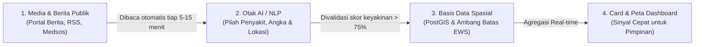

# 📌 Panduan Ringkas Metrik Dashboard Surveilans AI (NLP)
**Dokumen Referensi untuk Pimpinan & Stakeholder EOC Kemenkes**

Dokumen ini menyajikan ringkasan alur kerja sistem dan penjelasan setiap indikator/angka pada dashboard secara padat dan mudah dipahami.

---

## 1. Alur Singkat: Bagaimana Berita Berubah Jadi Angka?

### 3 Tahapan Pemrosesan:
1. **Pengumpulan (*Crawling*)**: Sistem membaca ribuan artikel dari media terpercaya (Detik, Kompas, Antara, media ASEAN, dan rilis dinas).
2. **Ekstraksi AI (*NLP Intelligence*)**: AI membaca kalimat demi kalimat untuk mendeteksi nama penyakit, jumlah orang sakit/meninggal, dan wilayah kejadian.
3. **Penyaringan & Skoring (*Validation & EWS*)**: Berita non-kesehatan dan hoax dibuang. Angka kasus dibandingkan dengan batas normal daerah untuk menentukan status bahaya (**Awas / Siaga / Waspada**).

---

## 2. Matriks Penjelasan Kartu Metrik (KPI Cards)

| Kartu Metrik | Artinya Apa? (Definisi Ringkas) | Dari Mana Datanya? | Bagaimana AI Mendapatkannya? | Logika Perhitungan |
| :--- | :--- | :--- | :--- | :--- |
| 🦠 **Detected Cases** *(Kasus Terdeteksi)* | Perkiraan jumlah warga yang tertular/terjangkit penyakit di wilayah terpantau. | Kutipan pernyataan resmi dinas/faskes dalam artikel berita online dan media publik. | AI mencari kalimat berkonteks jumlah penderita (misal: *"sebanyak 45 warga terjangkit DBD"*), lalu memvalidasi agar angka tidak tertukar dengan tanggal atau tahun. | **Total Kasus Bulan Berjalan**. Badge persentase di bawahnya menunjukkan kenaikan/penurunan dibanding bulan sebelumnya. |
| ⚰️ **Deaths** *(Kematian)* | Jumlah korban jiwa akibat penyakit tertentu yang telah diberitakan. | Berita konfirmasi dari rumah sakit, BPBD, atau rilis dinas kesehatan. | AI mendeteksi kata kunci fatalitas (*meninggal, wafat, korban jiwa*) dan mengaitkannya secara spesifik ke penyakit terkait. | **Total Kematian Bulan Berjalan**. Menunjukkan tren fatalitas wabah bulan ini vs bulan lalu. |
| 📋 **Validated Events** *(Laporan Tervalidasi)* | Jumlah kejadian/artikel unik yang sudah lolos uji keaslian dan relevansi medis oleh AI. | Hasil kurasi otomatis dari seluruh artikel berita mentah yang masuk. | AI menguji apakah topik berita murni tentang kesehatan (*health-related*) dan skor keyakinannya tinggi (*confidence score* di atas ambang aman). | **Hitungan Unik ID Kejadian**. Laporan duplikat atau topik di luar kesehatan otomatis disaring keluar. |
| 📍 **Locations** *(Wilayah Terpantau)* | Jumlah kota, kabupaten, atau provinsi tempat ditemukannya kasus penyakit aktif. | Nama daerah geografis yang tertulis di dalam isi berita. | AI mengenali nama daerah (*Named Entity Recognition*), lalu mencocokkannya ke koordinat peta resmi Indonesia/ASEAN (PostGIS). | **Total Titik Geografis Unik** `Count(Distinct Lokasi)` yang memiliki minimal 1 kasus aktif. |
| ⚠️ **Active Alerts** *(Peringatan Bahaya EWS)* | Jumlah sinyal darurat aktif karena laju penularan penyakit telah **melebihi batas aman**. | Dihitung otomatis oleh mesin Early Warning System (EWS) Kemenkes. | Sistem membandingkan angka kasus riil dengan tabel batas toleransi (*Outbreak Threshold*). Jika melebihi, status dinaikkan ke **Waspada / Siaga / Awas**. | **Jumlah Wilayah Berstatus Darurat**. Menjadi kompas prioritas pimpinan untuk segera menerjunkan tim medis. |

---

## 3. Matriks Panel Visualisasi & Fitur Tambahan

| Fitur / Panel | Fungsi Utama | Nilai Manfaat untuk Pimpinan |
| :--- | :--- | :--- |
| 🚨 **Daftar Sinyal EWS** | Menampilkan daftar daerah paling darurat (diurutkan dari level **AWAS / Merah**). | Membantu penentuan skala prioritas pengiriman logistik dan obat-obatan darurat. |
| 🗺️ **Peta Spasial (GIS)** | Peta sebaran titik kasus, radius potensi wabah, serta layer bencana alam BNPB (gempa, banjir). | Melihat visualisasi klaster penularan lintas wilayah dalam satu pandangan utuh. |
| 📈 **Grafik Tren Bulanan** | Garis kurva pergerakan kasus dan kematian harian/bulanan. | Memantau apakah wabah sedang menuju puncak (*peak*) atau sudah melandai terkendali. |
| 📑 **Tabel Rincian & Bukti Berita** | Rekap detail per baris lengkap dengan skor keyakinan AI dan tautan sumber asli. | **Transparansi & Akuntabilitas**: Setiap angka kasus memiliki bukti cuplikan berita asal yang bisa diverifikasi langsung. |

---

## 4. Tanya Jawab Cepat Stakeholder (Executive FAQ)

> **Q: Mengapa angka di dashboard bisa berbeda dengan laporan bulanan puskesmas/dinkes?**  
> **A:** Dashboard ini bertindak sebagai **radar peringatan dini (*Early Signal Radar*)** berbasis *open-source intelligence*. Sistem menangkap sinyal kejadian dalam hitungan menit setelah berita terbit, sebelum laporan formal berjenjang dari fasilitas kesehatan selesai direkap pada akhir bulan.

> **Q: Bagaimana sistem mencegah masuknya berita bohong (*hoax*)?**  
> **A:** Sistem memiliki penyaring kredibilitas domain media, verifikasi kata kunci medis (*symptom & disease dictionary*), serta penilaian tingkat keyakinan (*confidence score*). Berita dengan skor rendah akan ditandai *Perlu Review* dan tidak langsung menaikkan status EWS.
