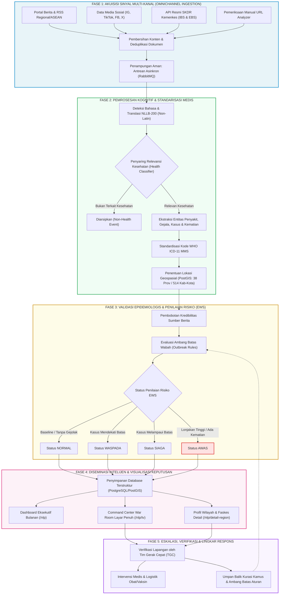

# Buku Panduan Proses Bisnis: Platform Disease Surveillance AI
## Sistem Intelijen Epidemiologi, Deteksi Dini Wabah (Early Warning System), dan Integrasi Surveilans Multi-Kanal Berstandar Internasional

---

| Parameter Dokumen | Informasi |
|---|---|
| **Judul Dokumen** | Panduan Proses Bisnis Platform Disease Surveillance AI |
| **Versi Dokumen** | 1.0 (Enterprise & Stakeholder Edition) |
| **Status** | Disetujui untuk Operasional & Referensi Pemangku Kepentingan |
| **Klasifikasi** | Internal / Panduan Strategis & Operasional |
| **Sasaran Pembaca** | Pimpinan Kementerian Kesehatan, Kepala Dinas Kesehatan Provinsi/Kabupaten/Kota, Direktur Pengendalian Penyakit Menular, Tim Epidemiologi & Tim Gerak Cepat (TGC), Analis Intelijen Kesehatan, Manajer Program Surveilans, serta Tim IT & Data Engineering. |

---

## Daftar Isi

1. [Ringkasan Eksekutif & Landasan Strategis Bisnis](#1-ringkasan-eksekutif--landasan-strategis-bisnis)
   - 1.1 Latar Belakang & Transformasi Paradigma
   - 1.2 Integrasi Dual-Pillar: Event-Based & Indicator-Based Surveillance
   - 1.3 Empat Nilai Strategis Utama bagi Organisasi Kesehatan
2. [Taksonomi Peran & Pemangku Kepentingan (Stakeholders)](#2-taksonomi-peran--pemangku-kepentingan-stakeholders)
   - 2.1 Profil Pemangku Kepentingan
   - 2.2 Matriks Tanggung Jawab & Wewenang (RACI Matrix)
3. [Arsitektur Siklus Proses Bisnis End-to-End (5 Tahapan Utama)](#3-arsitektur-siklus-proses-bisnis-end-to-end-5-tahapan-utama)
   - 3.1 Diagram Alur Visual Proses Bisnis
   - 3.2 Fase 1: Akuisisi Sinyal Multi-Kanal (Omnichannel Signal Acquisition)
   - 3.3 Fase 2: Pemrosesan Kognitif & Harmonisasi Medis (AI/NLP & Medical Normalization)
   - 3.4 Fase 3: Validasi Epidemiologis & Penilaian Risiko (Epidemiological Triage & EWS)
   - 3.5 Fase 4: Diseminasi Intelijen & Visualisasi Keputusan (Executive Situational Awareness)
   - 3.6 Fase 5: Eskalasi, Verifikasi Lapangan & Lingkar Respons (Action & Feedback Loop)
4. [Tata Kelola, Integritas Data & Mitigasi Risiko](#4-tata-kelola-integritas-data--mitigasi-risiko)
   - 4.1 Pemisahan Sinyal Rumor (EBS) vs Data Diagnostik Klinis (IBS)
   - 4.2 Prinsip Transparansi & Keterlacakan Bukti (Explainable AI & Audit Trail)
   - 4.3 Ketahanan Operasional & Pengamanan Data
5. [Indikator Kinerja Utama Bisnis (Business KPIs)](#5-indikator-kinerja-utama-bisnis-business-kpis)
6. [Glosarium Istilah Stakeholder](#6-glosarium-istilah-stakeholder)

---

## 1. Ringkasan Eksekutif & Landasan Strategis Bisnis

### 1.1 Latar Belakang & Transformasi Paradigma

Dalam tata kelola kesehatan masyarakat modern, ancaman penyakit menular dan kejadian luar biasa (KLB) berkembang dengan kecepatan yang melampaui kemampuan pelaporan birokrasi konvensional. Pendekatan surveilans pasif tradisional—di mana data dikompilasi secara berjenjang dari fasilitas pelayanan kesehatan tingkat primer ke dinas kesehatan hingga kementerian—memiliki jeda waktu (*reporting latency*) antara **7 hingga 21 hari**. Keterlambatan ini sering kali menyebabkan intervensi kesehatan baru berjalan ketika wabah telah memasuki fase eksponensial di masyarakat.

Platform **Disease Surveillance AI** hadir melakukan transformasi mendasar: mengubah paradigma dari **surveilans reaktif berbasis laporan tertunda** menjadi **intelijen kesehatan proaktif berbasis sinyal dini waktu-nyata (*real-time early signal intelligence*)**.

```text
[ PARADIGMA LAMA: REAKTIF & MANUAL ]
Kasus Muncul ──> Pasien Berobat ──> Rekap Mingguan Faskes ──> Verifikasi Berjenjang ──> [KLB Terlanjur Meluas]
(Jeda Deteksi: 7 s/d 21 Hari)

[ PARADIGMA BARU: DISEASE SURVEILLANCE AI ]
Sinyal Komunitas / Berita / Sosmed / API SKDR ──> Ekstraksi AI ──> Standarisasi WHO ──> EWS Alerting ──> [Respon Cepat Jam/Hari]
(Jeda Deteksi: Hitungan Jam s/d < 24 Jam)
```

### 1.2 Integrasi Dual-Pillar: Event-Based & Indicator-Based Surveillance

Platform ini menyatukan dua metodologi surveilans epidemiologis yang saling melengkapi ke dalam satu ekosistem terpadu:

1. **Event-Based Surveillance (EBS) / Surveilans Berbasis Kejadian**:
   - Menangkap rumor, percakapan publik, pemberitaan media massa, kanal RSS, serta postingan media sosial terkait gejala atau klaster kematian mendadak yang belum sempat dilaporkan ke fasilitas medis formal.
   - Karakteristik: Kecepatan penemuan sinyal sangat tinggi (*high timeliness*), cakupan luas lintas batas, namun memerlukan penyaringan cerdas untuk mengeliminasi disinformasi (*noise filtering*).
2. **Indicator-Based Surveillance (IBS) / Surveilans Berbasis Indikator**:
   - Mengintegrasikan data terstruktur rutin dari sistem pelaporan resmi pemerintah, khususnya **Sistem Kewaspadaan Dini dan Respon (SKDR)** Kementerian Kesehatan Republik Indonesia (melalui sinkronisasi data mingguan `/api/Alert` dan investigasi kejadian `/api/ebs`).
   - Karakteristik: Kepastian data dan validitas klinis tinggi (*high clinical fidelity*), berbasis indikator angka kasus dan kematian faskes terdaftar.

### 1.3 Empat Nilai Strategis Utama bagi Organisasi Kesehatan

Penerapan platform ini memberikan 4 keuntungan strategis bagi pimpinan dan pengambil kebijakan:

| Nilai Strategis | Manfaat Bisnis & Dampak Operasional | Indikator Keberhasilan |
|---|---|---|
| **1. Kecepatan Deteksi Dini (Early Warning Window)** | Memangkas *lead time* deteksi wabah dari hitungan minggu menjadi jam. Pimpinan menerima peringatan dini sebelum keterisian tempat tidur rumah sakit (BOR) melonjak. | Peringatan EWS terbit dalam < 6 jam sejak berita atau rumor terpublikasi di media massa daring. |
| **2. Kepatuhan Standar Global (WHO ICD-11)** | Seluruh istilah penyakit lokal, singkatan daerah, atau istilah populer diselaraskan secara otomatis ke klasifikasi resmi **WHO ICD-11 MMS**. Tidak ada ambiguitas istilah medis antar-wilayah. | 100% entitas penyakit pada agregasi utama tervalidasi ke kamus konsep internasional. |
| **3. Intelijen Lintas Batas (ASEAN Surveillance)** | Kemampuan menerjemahkan dan menganalisis berita dari 11 negara ASEAN dengan aksara lokal (Thai, Khmer, Lao, Myanmar, Vietnam) tanpa ketergantungan API penerjemah berbayar eksternal. | Deteksi ancaman penyakit infeksi emerging (*imported cases*) dari negara tetangga sebelum menyeberang perbatasan. |
| **4. Keterlacakan Bukti Penuh (Verifiable Evidence)** | Menghilangkan keraguan atas angka dashboard. Setiap metrik dapat diklik hingga menampilkan artikel berita asli, sumber penerbit, tanggal terbit faktual, dan kutipan kalimat pendukung. | Eliminasi *hallucination risk*; keputusan intervensi didukung bukti audit transparan. |

---

## 2. Taksonomi Peran & Pemangku Kepentingan (Stakeholders)

Keberhasilan implementasi sistem intelijen kesehatan bergantung pada kejelasan mandat, hak akses, dan pola interaksi setiap pemangku kepentingan.

### 2.1 Profil Pemangku Kepentingan

```
                       ┌─────────────────────────────────────────┐
                       │       DEWAN EKSEKUTIF / PIMPINAN        │
                       │  (Menteri, Dirjen P2P, Kadinkes Prov)   │
                       └────────────────────┬────────────────────┘
                                            │ Menetapkan Kebijakan & Darurat
                                            ▼
                       ┌─────────────────────────────────────────┐
                       │     TIM EPIDEMIOLOGI & GERAK CEPAT      │
                       │   (Epidemiolog, TGC Dinkes, RS Rujukan) │
                       └────────────────────▲────────────────────┘
                                            │ Investigasi & Aksi Lapangan
                                            ▼
                       ┌─────────────────────────────────────────┐
                       │    ANALIS INTELIJEN & OPERATOR DATA     │
                       │     (Health Data Analysts, Curators)    │
                       └────────────────────▲────────────────────┘
                                            │ Pemantauan Sinyal & Kurasi
                                            ▼
                       ┌─────────────────────────────────────────┐
                       │      ADMINISTRATOR & DATA ENGINEER      │
                       │      (IT Infra, DB & AI Specialist)     │
                       └─────────────────────────────────────────┘
```

#### A. Dewan Eksekutif & Pimpinan Kebijakan (Executive Sponsor / Policy Maker)
- **Profil**: Menteri Kesehatan, Direktur Jenderal P2P, Kepala Dinas Kesehatan Provinsi/Kabupaten, Direktur Rumah Sakit Umum Pusat.
- **Kebutuhan Utama**: Gambaran situasi makro yang ringkas, akurat, dan dapat dipertanggungjawabkan; indikator tren bulanan/tahunan; peta risiko penyebaran; serta rekomendasi aksi intervensi.
- **Antarmuka Utama**: Dashboard Eksekutif (`/nlp`), Command Center War Room (`/nlp/tv`), Laporan Ringkasan Cerdas (*AI Summary*).

#### B. Tim Epidemiologi & Tim Gerak Cepat (Epidemiologists & TGC)
- **Profil**: Epidemiolog Madya/Utama, Petugas Surveilans Lapangan, Tim Tanggap Darurat Kesehatan Masyarakat (PHEOC).
- **Kebutuhan Utama**: Sinyal peringatan dini terverifikasi (*EWS Verified Alerts*), tren kurva mingguan per penyakit, persebaran spasial hingga tingkat 514 kabupaten/kota, rincian kasus/kematian, serta verifikasi bukti artikel.
- **Antarmuka Utama**: Modul Detail Wilayah (`/nlp/detail-region`), Kartu Verifikasi EWS, Tabel Bukti Analisis Spasial, Riwayat Laporan SKDR IBS/EBS.

#### C. Analis Intelijen Kesehatan & Operator Data (Health Analysts & Curators)
- **Profil**: Analis data kesehatan, staf teknis surveilans digital, operator media monitoring.
- **Kebutuhan Utama**: Pemantauan aliran data terkini (*Live Crawling Feed*), analisis mendalam URL berita khusus (*URL Analyzer*), penelaahan kandidat istilah penyakit baru (*Disease Discovery Candidates*), serta validasi sumber berita.
- **Antarmuka Utama**: URL Analyzer (`/nlp/analyze`), Master Kamus Penyakit (`/nlp/nlp-keywords`), Master Label NLP (`/nlp/nlp-labels`), Registry Kredibilitas Sumber (`/nlp/source-credibility`).

#### D. Administrator Sistem & Data Engineer (IT Infrastructure & AI Engineer)
- **Profil**: DevOps Engineer, Database Administrator, ML Engineer, Penanggung Jawab Integrasi Sistem Informasi Kemenkes.
- **Kebutuhan Utama**: Monitoring antrean data (*Queue Depth*), riwayat eksekusi pengumpulan (*Collector Runs*), pemeliharaan kamus geospasial PostGIS (38 provinsi/514 kabupaten), dan penyesuaian ambang batas (*Outbreak Rules*).
- **Antarmuka Utama**: Panel Pemrosesan Sistem (`/nlp/processing`), Registry Sumber Data (`/nlp/sources`), Pengaturan Aturan Wabah (`/nlp/outbreak-rules`), Manajemen Wilayah Spasial (`/nlp/locations`).

---

### 2.2 Matriks Tanggung Jawab & Wewenang (RACI Matrix)

Matriks berikut mendefinisikan pembagian peran: **R** (*Responsible* - Pelaksana utama), **A** (*Accountable* - Penanggung jawab akhir/pemilik wewenang), **C** (*Consulted* - Dimintai masukan teknis/spesialis), dan **I** (*Informed* - Menerima informasi/laporan).

| Tahapan Aktivitas Proses Bisnis | Dewan Eksekutif | Tim Epidemiolog & TGC | Analis Intelijen Data | Admin & Data Engineer |
|---|:---:|:---:|:---:|:---:|
| **1. Pengaturan Sumber Data & Jadwal Pengumpulan** | I | C | R | **A** |
| **2. Penyerapan Sinyal (EBS, Sosmed, SKDR API)** | I | I | C | **R / A** |
| **3. Analisis Ad-Hoc URL Berita Tertarget** | I | C | **R / A** | I |
| **4. Pemrosesan AI/NLP & Standarisasi WHO ICD-11** | I | C | C | **R / A** |
| **5. Kurasi Calon Istilah Penyakit Baru (*Discovery*)** | I | **A** | R | C |
| **6. Penentuan Ambang Batas Wabah (*Thresholds*)** | C | **A** | C | R |
| **7. Pemantauan & Triage Sinyal EWS Harian** | I | **A** | R | I |
| **8. Investigasi Lapangan & Verifikasi Kasus Faskes** | I | **R / A** | I | I |
| **9. Penetapan Status Waspada/Siaga/Awas & Intervensi** | **A** | R | I | I |
| **10. Evaluasi Kinerja Sistem & Kalibrasi Model** | C | C | C | **R / A** |

---

## 3. Arsitektur Siklus Proses Bisnis End-to-End (5 Tahapan Utama)

Siklus operasional sistem dirancang dalam 5 tahapan berkesinambungan yang menjamin aliran data dari sinyal mentah masyarakat hingga keputusan intervensi pimpinan.

### 3.1 Diagram Alur Visual Proses Bisnis



---

### 3.2 Fase 1: Akuisisi Sinyal Multi-Kanal (Omnichannel Signal Acquisition)

Tujuan fase ini adalah menghimpun seluruh sinyal kesehatan masyarakat dari berbagai penjuru tanpa menimbulkan beban ganda bagi pelaksana di lapangan.

#### A. Penyerapan Sinyal Terbuka (Event-Based Surveillance - EBS)
- **Portal Berita & RSS Media Massa**: Sistem secara berkala menyisir ratusan kanal berita kredibel nasional, lokal, dan regional ASEAN. Pembersihan DOM tingkat lanjut (*Trafilatura & stealth scraping*) membuang seluruh elemen iklan, menu navigasi, dan rekomendasi artikel lain sehingga hanya menyisakan judul, tanggal publikasi faktual, dan teks inti laporan.
- **Sinyal Media Sosial (Digital Footprint)**: Menerima data postingan dan percakapan publik (Instagram, TikTok, Facebook, X) yang merekam keluhan gejala di komunitas. Data ini diidentifikasi sebagai **sinyal indikasi awal**, bukan konfirmasi klinis resmi.

#### B. Integrasi Data Resmi Pemerintah (Indicator-Based Surveillance - IBS)
- **Konektor API SKDR Kemenkes RI**:
  - `POST /api/Alert` (IBS): Menarik agregasi data mingguan per penyakit dari fasilitas kesehatan di seluruh Indonesia.
  - `POST /api/ebs` (EBS SKDR): Menarik laporan verifikasi rumor atau kejadian luar biasa yang tercatat pada modul EBS resmi kementerian.
  - Seluruh respons asli disimpan utuh dalam format JSONB (`skdr_reports.payload`) untuk kepentingan audit medis dan kepatuhan hukum (*regulatory compliance*).

#### C. Analisis Ad-Hoc URL Mandiri (*URL Analyzer*)
- Petugas intelijen kesehatan yang menemukan tautan berita mencurigakan dapat memasukkan URL langsung ke sistem. Sistem akan mengekstrak, membersihkan, menerjemahkan, dan menganalisis artikel tersebut secara instan tanpa mengotori agregasi riwayat sebelumnya (*clean URL replacement*).

#### D. Pengamanan Antrean Data (Enterprise Queueing)
- Seluruh sinyal yang masuk disimpan ke dalam antrean asinkron **RabbitMQ**. Mekanisme ini menjamin tidak ada data yang hilang meskipun terjadi lonjakan berita secara mendadak (*traffic spike*) atau ketika salah satu subsistem sedang dalam pemeliharaan.

---

### 3.3 Fase 2: Pemrosesan Kognitif & Harmonisasi Medis (AI/NLP & Medical Normalization)

Setelah sinyal dihimpun, mesin kognitif AI memvalidasi dan menerjemahkan teks bebas menjadi data epidemiologi terstruktur.

```text
[ ARTIKEL MENTAH ]
"Warga di pedalaman NTT dilaporkan terserang demam berdarah hebat, 15 anak dirawat di RSUD dan 1 meninggal..."
                                │
                                ▼
1. Deteksi Bahasa               : Bahasa Indonesia (id)
2. Filter Relevansi Kesehatan   : YA (is_health_related = TRUE, Confidence: 0.96)
3. Ekstraksi Medis              : 
   - Penyakit Utama             : Dengue Fever / Demam Berdarah Dengue
   - Kode WHO ICD-11 MMS        : 1D20 (Dengue without warning signs)
   - Estimasi Kasus             : 15 kasus
   - Estimasi Kematian          : 1 kematian
   - Gejala Terdeteksi          : Demam tinggi
4. Geospasial                    : Nusa Tenggara Timur (Lat: -8.65, Long: 121.07)
5. Tingkat Sentimen             : Negatif (Skor: 0.88 - Krisis Kesehatan)
```

#### Langkah Kritis Pemrosesan:

1. **Penerjemahan Multibahasa ASEAN (NLLB-200 Lokal)**:
   - Teks berbahasa non-Latin (Thai, Khmer, Lao, Burma) diterjemahkan secara internal menggunakan model NLLB-200. Hal ini menjamin independensi operasional tanpa ketergantungan biaya API pihak ketiga serta menjaga kerahasiaan data intelijen kesehatan nasional.
2. **Pintu Penapisan Relevansi Kesehatan (*Binary Health Filter*)**:
   - Artikel disaring untuk memilah apakah laporan tersebut benar-benar berkaitan dengan kesehatan manusia atau sekadar berita metaforis (misalnya: istilah *wabah korupsi* atau *demam panggung*). Laporan non-kesehatan langsung diarsipkan dan tidak diizinkan masuk ke dashboard.
3. **Penyelarasan Nomenklatur Standar WHO ICD-11 MMS**:
   - Seluruh variasi nama penyakit daerah (contoh: *DBD, Demam Dengue, Dengue Fever*) dipetakan ke konsep kanonikal resmi WHO.
   - Sistem membedakan **Penyakit Utama (*Primary Disease*)** yang menjadi fokus kejadian dengan **Penyakit Penyerta (*Secondary Mentions*)** yang hanya disebut sebagai latar belakang atau pembanding.
4. **Karantina Penyakit Baru (*Disease Discovery Quarantine*)**:
   - Apabila AI menemukan indikasi penyakit yang belum terdaftar pada kamus resmi WHO (misalnya patogen baru / *Disease X*), istilah tersebut **tidak langsung dimasukkan ke dashboard**, melainkan dikarantina di tabel `disease_discovery_candidates` untuk ditinjau oleh epidemiolog.
5. **Normalisasi Geospasial Spasial PostGIS**:
   - Nama wilayah dicocokkan dengan basis data spasial resmi yang mencakup **38 Provinsi dan 514 Kabupaten/Kota** di Indonesia serta koordinat negara-negara ASEAN. Sinyal tanpa koordinat geografis yang valid tidak akan diizinkan memicu alarm peta.

---

### 3.4 Fase 3: Validasi Epidemiologis & Penilaian Risiko (Epidemiological Triage & EWS)

Pada fase ini, sistem melakukan penyaringan berbasis aturan klinis ketat untuk membedakan antara "kebisingan informasi" (*noise*) dengan "ancaman nyata" (*true signal*).

#### A. Pembobotan Kredibilitas Sumber (*Source Credibility Scoring*)
Setiap sumber memiliki bobot kepercayaan berbeda:
- **Tingkat 1 (Sangat Tinggi)**: Sistem resmi pemerintah (SKDR Kemenkes, WHO, Kemenkes ASEAN).
- **Tingkat 2 (Tinggi)**: Kantor berita nasional dan portal media arus utama terverifikasi Dewan Pers.
- **Tingkat 3 (Sedang)**: Media lokal terdaftar, siaran pers faskes regional.
- **Tingkat 4 (Indikasi Awal)**: Laporan media sosial dan forum komunitas (memerlukan konfirmasi silang).

#### B. Evaluasi Ambang Batas Wabah (*Disease Outbreak Thresholds*)
Setiap penyakit memiliki karakteristik epidemiologi yang berbeda. Ambang batas diatur secara spesifik pada database:
- Penyakit berisiko tinggi (misal: *Polio, Flu Burung / Avian Influenza, Antraks*): **1 kasus saja** sudah memenuhi kriteria lonjakan kewaspadaan.
- Penyakit endemis (misal: *Demam Berdarah / DBD, Diare, ISPA*): Menggunakan ambang batas kasus minimum sebelum status dinaikkan.

#### C. Matriks Penentuan Status Kewaspadaan Dini EWS

Tingkat keparahan (*severity level*) ditentukan melalui logika bertingkat:

```text
┌─────────────────────────────────────────────────────────────────────────────┐
│                      LOGIKA PENENTUAN STATUS EWS                            │
├───────────────────┬─────────────────────────────────────────────────────────┤
│ Status EWS        │ Kondisi Pemicu                                          │
├───────────────────┼─────────────────────────────────────────────────────────┤
│ 🔴 AWAS (Critical)│ Terdapat laporan KEMATIAN > 0, ATAU                     │
│                   │ Jumlah kasus >= 2 x Ambang Batas (Threshold) Penyakit   │
├───────────────────┼─────────────────────────────────────────────────────────┤
│ 🟠 SIAGA (High)   │ Jumlah kasus mencapai / melampaui Ambang Batas, ATAU    │
│                   │ Model AI mendeteksi kata kunci eksplisit KLB / Outbreak │
├───────────────────┼─────────────────────────────────────────────────────────┤
│ 🟡 WASPADA (Watch)│ Jumlah kasus mendekati ambang batas (>= 75% Threshold)  │
├───────────────────┼─────────────────────────────────────────────────────────┤
│ 🟢 NORMAL         │ Jumlah kasus jauh di bawah ambang batas (baseline)      │
└───────────────────┴─────────────────────────────────────────────────────────┘
```

> [!IMPORTANT]
> **Kriteria Wajib Kelayakan Sinyal (EWS Verified Criteria)**:
> Suatu kejadian hanya dapat menyandang status **Active Alert** pada dashboard jika memenuhi 4 syarat mutlak:
> 1. Tingkat keyakinan model (*Confidence Score*) minimal **0.35**;
> 2. Memiliki nama lokasi yang teridentifikasi jelas;
> 3. Memiliki koordinat lintang (*latitude*) dan bujur (*longitude*) yang valid;
> 4. Memiliki tanggal publikasi faktual yang valid (bukan sekadar waktu pencatatan sistem).

---

### 3.5 Fase 4: Diseminasi Intelijen & Visualisasi Keputusan (Executive Situational Awareness)

Data yang telah tervalidasi disajikan kepada berbagai lapisan pemangku kepentingan melalui antarmuka visual terdedikasi:

#### 1. Dashboard Situasional Eksekutif (`/nlp`)
- **Tujuan**: Memberikan gambaran makro bulanan dan tahunan bagi penentu kebijakan.
- **Komponen Kunci**:
  - **Kartu Tren Bulanan**: Kasus, Kematian, Kejadian Tervalidasi, dan Total Peringatan Aktif yang membandingkan bulan berjalan (*current month*) terhadap bulan sebelumnya (*previous month*).
  - **Ringkasan Intelijen Cerdas (*AI Summary*)**: Sintesis otomatis berbasis aturan epidemiologi yang merangkum wilayah paling rentan dan penyakit dengan risiko tertinggi hari ini.
  - **Peta Interaktif Spasial**: Sebaran titik wabah dengan pewarnaan berdasarkan status EWS (*Normal, Waspada, Siaga, Awas*), dilengkapi visualisasi lapisan bencana BNPB dan simulasi arah angin.
  - **Performa Mesin Crawling**: Transparansi operasional yang menampilkan volume dokumen yang diserap per jenis sumber (web, media sosial, RSS, SKDR).

#### 2. Command Center Layar Penuh War Room (`/nlp/tv`)
- **Tujuan**: Dirancang khusus untuk monitor besar di ruang pusat komando krisis (*Health Emergency Operations Center / HEOC*).
- **Fitur Khusus**:
  - Tampilan otomatis diperbarui secara berkala (*auto-refresh*).
  - **Live Crawling Feed (Panel Kiri)**: Mengalirkan sinyal berita dan media sosial terkini secara instan dalam hitungan detik.
  - Visualisasi grafik epidemiologi dan peta risiko nasional.

#### 3. Analisis Wilayah & Fasilitas Kesehatan Mendalam (`/nlp/detail-region`)
- **Tujuan**: Digunakan oleh tim teknis surveilans dan dinas kesehatan provinsi untuk membedah akar masalah di suatu wilayah.
- **Fitur Khusus**:
  - Kurva tren mingguan (*Epidemiological Weeks W-1 s/d W-52*).
  - Integrasi perbandingan sinyal IBS vs EBS.
  - Distribusi kesiapan fasilitas pelayanan kesehatan (Rumah Sakit, Puskesmas, Pustu, dan Klinik).

---

### 3.6 Fase 5: Eskalasi, Verifikasi Lapangan & Lingkar Respons (Action & Feedback Loop)

Informasi intelijen tidak berhenti pada layar monitor, melainkan menggerakkan tindakan nyata di lapangan:

```text
[ ALERT EWS AKTIF: SIAGA / AWAS ]
               │
               ▼
[ 1. Verifikasi Data oleh Tim Epidemiolog ] ──(Data Anomali)──> [ Batalkan Alert / Review ]
               │ (Data Sah & Konsisten)
               ▼
[ 2. Penerbitan Early Warning Bulletin ke Dinkes Setempat ]
               │
               ▼
[ 3. Mobilisasi Tim Gerak Cepat (TGC) ke Lokasi Kasus ]
               │
               ├──> Penyelidikan Epidemiologi (PE) & Tracing Kontak
               ├──> Pengambilan Sampel Laboratorium (BBLK / Balai Litbangkes)
               └──> Penguatan Tatalaksana Faskes & Buffer Stok Obat
               │
               ▼
[ 4. Umpan Balik Sistem (Feedback Loop) ]
               ├──> Pemutakhiran Status Laporan pada Sistem
               └──> Kalibrasi Ulang Ambang Batas Penyakit jika Ada Pergeseran Endemisitas
```

1. **Eskalasi Cepat**: Notifikasi otomatis saat status wilayah menyentuh status `SIAGA` atau `AWAS` kepada narahubung surveilans setempat.
2. **Penyelidikan Epidemiologi Lapangan (PE)**: Petugas TGC melakukan pelacakan kontak erat dan pengambilan sampel diagnostik laboratorium untuk konfirmasi definitif.
3. **Lingkar Pembelajaran Sistem (*Continuous Improvement*)**:
   - Jika hasil laboratorium mengonfirmasi adanya strain penyakit baru, kurator mempromosikan kandidat penyakit dari `disease_discovery_candidates` ke kamus aktif `disease_concepts`.
   - Ambang batas kasus disesuaikan secara berkala sesuai dinamika musim (misalnya saat memasuki musim hujan untuk penyakit berbasis vektor nyamuk).

---

## 4. Tata Kelola, Integritas Data & Mitigasi Risiko

Penerapan kecerdasan buatan dalam ranah kesehatan masyarakat wajib mematuhi standar etika, akuntabilitas, dan keamanan data tertinggi.

### 4.1 Pemisahan Sinyal Rumor (EBS) vs Data Diagnostik Klinis (IBS)

Platform secara tegas memisahkan bobot interpretasi antara kedua kelompok data:
- **Data EBS (Berita & Media Sosial)** disajikan sebagai **Indikasi Sinyal Ancaman (*Threat Signal*)**. Data ini berguna untuk memicu kewaspadaan dini, bukan untuk menetapkan diagnosis medis resmi seorang individu.
- **Data IBS (SKDR Kemenkes)** disajikan sebagai **Data Terkonfirmasi Fasilitas Kesehatan (*Clinical/Reporting Data*)**.
- Pemisahan ini mencegah terjadinya kepanikan publik yang tidak perlu (*panic avoidance*) sekaligus memastikan pimpinan tidak mengambil kebijakan berbasis rumor yang belum diverifikasi.

### 4.2 Prinsip Transparansi & Keterlacakan Bukti (Explainable AI & Audit Trail)

Sistem mengadopsi prinsip *No Black-Box AI*:
- **Tautan Bukti Faktual**: Setiap angka kasus dan peringatan pada dashboard dapat ditelusuri langsung ke dokumen sumber aslinya.
- **Evidence Snippets**: Sistem menyimpan kalimat persis di mana nama penyakit, jumlah korban, dan lokasi disebutkan dalam teks berita.
- **Deduplikasi URL Ketat**: Mencegah satu peristiwa yang diberitakan oleh 50 media berbeda dihitung sebagai 50 wabah terpisah. URL yang sama hanya diproses satu kali, dan jika diproses ulang akan memutakhirkan rekaman yang sudah ada (*deduplication guarantee*).

### 4.3 Ketahanan Operasional & Pengamanan Data

1. **Perlindungan Terhadap Data Rusak (*Poison-Pill Protection*)**:
   - Jika terdapat dokumen yang gagal diproses akibat format teks yang rusak, pesan tersebut diberi batas percobaan (*delivery attempt cap*) maksimal 3 kali sebelum dialihkan ke antrean karantina (*dead-letter storage*), sehingga tidak menghentikan antrean dokumen lainnya.
2. **Kedaulatan Data & Pemrosesan Mandiri (*Self-Hosted & Privacy Preserving*)**:
   - Pemrosesan NLP, basis data PostGIS, dan model translasi dijalankan di infrastruktur lokal (on-premise / private cloud) kementerian/lembaga terkait. Tidak ada data intelijen kesehatan nasional yang dikirimkan ke server publik asing.

---

## 5. Indikator Kinerja Utama Bisnis (Business KPIs)

Evaluasi efektivitas platform diukur melalui metrik keberhasilan bisnis berikut:

| Kategori KPI | Indikator Kinerja | Formula / Definisi Operasional | Target Standar |
|---|---|---|:---:|
| **Kecepatan (Timeliness)** | *Detection Lead Time* | Selisih waktu publikasi berita pertama hingga terbitnya peringatan EWS di dashboard. | < 6 Jam |
| **Kualitas Deteksi** | *False Alert Ratio* | Persentase peringatan SIAGA/AWAS yang setelah diverifikasi lapangan terbukti tidak valid. | < 10% |
| **Kepatuhan Standar** | *WHO ICD-11 Alignment* | Rasio entitas penyakit pada agregasi utama yang berhasil dipetakan ke kode kanonikal WHO. | > 95% |
| **Cakupan Spasial** | *Sub-National Coverage* | Persentase dari 514 kabupaten/kota yang memiliki pemantauan aktif sinyal kesehatan. | 100% Kab/Kota |
| **Keandalan Ingesti** | *Deduplication Success Rate* | Keberhasilan sistem dalam menyaring artikel ganda dari peristiwa berita yang sama. | > 99% |
| **Respon Operasional** | *Triage Response Time* | Waktu yang dibutuhkan analis untuk meninjau peringatan status AWAS. | < 2 Jam |

---

## 6. Glosarium Istilah Stakeholder

Untuk menjembatani komunikasi antara tim teknis, epidemiolog, dan pembuat kebijakan, berikut panduan istilah yang digunakan dalam ekosistem sistem:

- **EBS (Event-Based Surveillance)**: Surveilans berbasis kejadian; penangkapan sinyal rumor kejadian kesehatan masyarakat yang tidak terstruktur dari berita, media sosial, dan laporan komunitas.
- **IBS (Indicator-Based Surveillance)**: Surveilans berbasis indikator; pengumpulan data terstruktur berkala dari fasilitas kesehatan (puskesmas, rumah sakit) berdasarkan definisi kasus standar.
- **SKDR (Sistem Kewaspadaan Dini dan Respon)**: Platform resmi Kementerian Kesehatan RI untuk mendeteksi ancaman penyakit menular potensial KLB secara berkala.
- **WHO ICD-11 MMS**: *International Classification of Diseases 11th Revision for Mortality and Morbidity Statistics*; standar klasifikasi medis global yang diterbitkan oleh Organisasi Kesehatan Dunia.
- **EWS (Early Warning System)**: Sistem peringatan dini yang membunyikan sinyal kewaspadaan sebelum situasi darurat kesehatan meluas.
- **Severity Level (Tingkat Keparahan)**: Klasifikasi status risiko wilayah yang terbagi menjadi empat tingkatan: *NORMAL* (Aman/Dasar), *WASPADA* (Mendekati Batas), *SIAGA* (Melampaui Batas/Outbreak), dan *AWAS* (Kritis/Ada Kematian).
- **Outbreak Rule (Aturan Ambang Batas)**: Ketetapan angka kasus minimum per jenis penyakit yang digunakan sistem untuk menentukan apakah suatu kejadian memenuhi syarat peringatan wabah.
- **Confidence Score (Tingkat Keyakinan AI)**: Angka probabilitas (0.0 s/d 1.0) yang mencerminkan tingkat kepastian model kecerdasan buatan terhadap hasil ekstraksi penyakit atau lokasi dari teks berita.
- **Case Fatality Rate (CFR)**: Rasio persentase jumlah kematian dibandingkan dengan total kasus penyakit yang dilaporkan pada periode yang sama.
- **Gazetteer Spasial**: Basis data direktori geografis yang memetakan nama wilayah (desa, kecamatan, kabupaten, provinsi, negara) ke titik koordinat garis lintang dan bujur secara presisi.
- **PostGIS**: Ekstensi basis data spasial yang memungkinkan sistem melakukan analisis pemetaan wilayah, penentuan radius dampak wabah, dan klasterisasi geografis.
- **Trafilatura**: Modul pembersihan teks yang bertugas mengisolasi badan naskah berita dari gangguan elemen web (iklan, banner, tautan eksternal).
- **Disease Discovery Candidates**: Area karantina data untuk menampung istilah penyakit baru temuan sistem yang memerlukan peninjauan dan validasi oleh pakar sebelum diaktifkan secara publik.
