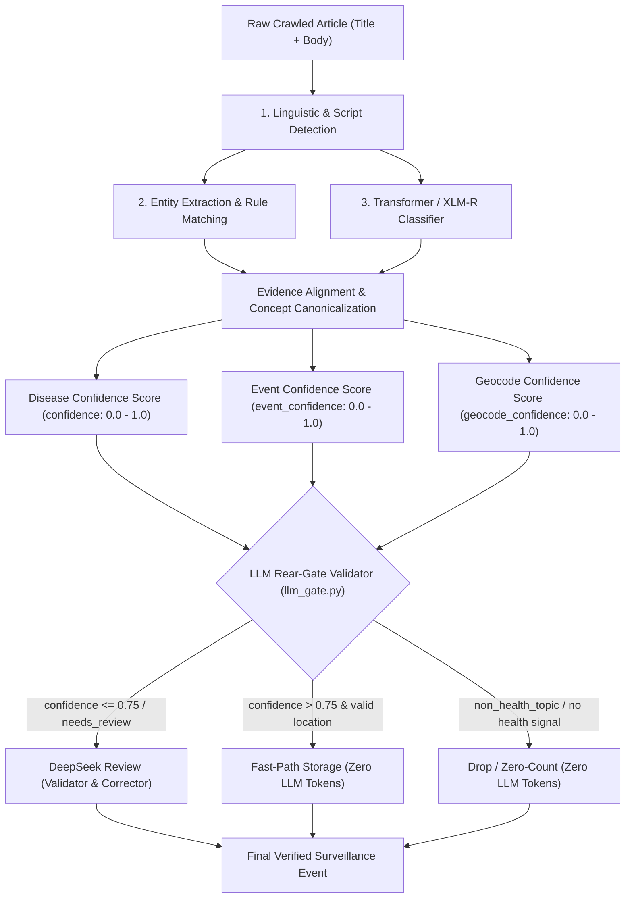

# Panduan Teknis: Perhitungan Confidence Score & Matriks Skenario Eskalasi LLM (Threshold <= 0.75)

Dokumen ini menjelaskan secara matematis dan arsitektural bagaimana **Confidence Score** dihitung di seluruh pipeline NLP surveilans penyakit (*Disease Intelligence*), alasan penetapan ambang batas **`0.75`**, implementasi operator inklusif (**`<= 0.75`**), serta matriks skenario pengujian kasus nyata (*Case 1 s.d. Case 10*).

---

## 1. Arsitektur Komputasi Confidence Score

Pipeline NLP surveilans tidak mengandalkan satu angka tunggal, melainkan mengkombinasikan 4 dimensi confidence yang saling melengkapi:



---

## 2. Rumus & Pembobotan Confidence

### 2.1 Disease Classification Confidence (`confidence`)
Dihitung pada [`services/nlp-python/app/intelligence.py`](file:///home/aspire_5/app/NLP-PENYAKIT/services/nlp-python/app/intelligence.py#L543) dan [`services/nlp-python/app/pipeline.py`](file:///home/aspire_5/app/NLP-PENYAKIT/services/nlp-python/app/pipeline.py#L442-L525):

| Nilai Confidence | Kondisi Pemicu (*Trigger Criteria*) | Status Investigasi |
|:---:|---|:---:|
| **`0.92`** | Penyakit tertera **eksplisit pada Judul atau Kalimat Utama (Lead)** dan hanya terdapat **1 kandidat penyakit tunggal** yang cocok dengan alias resmi ASEAN Master Concept. | Sangat Tinggi (Lolos Otomatis) |
| **`0.90`** | Penyakit tervalidasi oleh *Disease Master Normalizer* dengan alias kanonik resmi di dalam teks artikel. | Tinggi (Lolos Otomatis) |
| **`0.85`** | Penyakit terverifikasi memiliki bukti tekstual langsung (*textual evidence*) di dalam badan artikel, atau hasil validasi sukses dari DeepSeek Rear-Gate. | Tinggi (Lolos Otomatis) |
| **`0.80`** | Entitas penyakit terdeteksi oleh kamus gazetteer/ground truth lokal, meskipun model XLM-R memprediksi label yang berbeda. | Cukup Tinggi (Lolos Otomatis) |
| **`0.75`** | **Threshold Ambang Batas (Boundary)**: Penyakit **hanya disebut 1 kali di tingkat paragraf** (bukan di judul/lead), tanpa penyebutan berulang di kalimat metrik kasus. | **Ambang Kritis (Wajib Review)** |
| **`0.68`** | Terdapat **beberapa kandidat penyakit ambigu** (misal artikel membandingkan *Dengue* dan *Chikungunya*). | Rendah (Wajib Review) |
| **`0.40`** | Hanya terdeteksi gejala umum (*symptoms only*, misal demam tinggi, ruam, nyeri sendi) tanpa nama penyakit spesifik. | Sangat Rendah (Wajib Review) |
| **`0.30`** | Prediksi model klasifikasi tidak memiliki bukti tekstual (*no textual evidence*) di seluruh isi artikel. Diturunkan ke `UNKNOWN`. | Tidak Valid (Jatuh ke UNKNOWN) |
| **`0.00`** | Artikel terdeteksi sebagai topik non-kesehatan (*academic study*, pertanian, judi online, militer, politik). | Non-Health (Eksklusi Penuh) |

### 2.2 Event Outbreak Confidence (`event_confidence`)
Dihitung pada [`services/nlp-python/app/pipeline.py`](file:///home/aspire_5/app/NLP-PENYAKIT/services/nlp-python/app/pipeline.py#L449-L665):
- **`0.90`**: Laporan Kejadian Luar Biasa eksplisit (`is_explicit_outbreak_report = True`) yang memuat kata kunci KLB, lonjakan wabah, atau penetapan status darurat dinas kesehatan.
- **`0.85`**: Penyakit teridentifikasi bukan `UNKNOWN` dan memiliki angka kasus aktif (`case_count > 0` atau `death_count > 0`).
- **`0.75`**: Artikel kesehatan umum atau pembaruan berkala edukasi (*health update*) tanpa sinyal wabah eksplisit.
- **`0.70`**: Artikel menyebutkan gejala kesehatan tanpa nama penyakit yang jelas, membutuhkan review kurator (`needs_review = True`).
- **`0.00`**: Bukan topik kesehatan atau teks noisy/terlalu pendek.

### 2.3 Geocode Confidence (`geocode_confidence`)
Dihitung pada modul resolusi wilayah (*gazetteer matcher*):
- **`0.90 - 0.95`**: Nama kota/kabupaten (*admin2*) cocok presisi dan berada di dalam batas administratif provinsi (*admin1*) dan negara target ASEAN.
- **`0.80`**: Nama provinsi/state (*admin1*) cocok, namun nama kota spesifik tidak disebutkan.
- **`0.70`**: Hanya nama negara (*country level*) yang terdeteksi.
- **`0.00` (`location_missing = True`)**: Tidak ada lokasi geografis yang terdeteksi di dalam teks artikel berita.

---

## 3. Logika Ambang Batas Inklusif `<= 0.75`

Mengapa ambang batas diatur menjadi **`confidence <= 0.75`** (menggunakan operator `<=` bukan `<`)?

```python
# Evaluasi pada services/nlp-python/app/llm_gate.py:
if unknown or confidence <= config.DEEPSEEK_TRIGGER_CONFIDENCE:
    return True
```

1. **Kasus Skor `0.750` pada Deteksi Paragraf**:
   Pada algoritma ekstraksi [`intelligence.py`](file:///home/aspire_5/app/NLP-PENYAKIT/services/nlp-python/app/intelligence.py#L543):
   ```python
   confidence = 0.92 if explicit and len(candidates) == 1 else (0.75 if len(paragraph_candidates) == 1 else (0.68 if candidates else 0.40))
   ```
   Ketika nama penyakit hanya muncul 1 kali di tengah paragraf berita (bukan judul utama), sistem memberikan skor **tepat `0.75`**.
   - **Jika memakai `< 0.75`**: Skor `0.750` akan lolos begitu saja tanpa review, padahal banyak berita hoax atau artikel opini yang hanya mencatut nama penyakit di paragraf penutup.
   - **Dengan `<= 0.75`**: Skor `0.750` secara tepat dan konsisten masuk ke rear-gate review DeepSeek untuk divalidasi apakah kasus tersebut benar-benar kejadian aktif atau sekadar referensi lampau.
2. **Efisiensi Anggaran Token (Guardrail)**:
   - Artikel dengan confidence `0.76` ke atas (misalnya `0.80`, `0.85`, `0.92`) langsung diproses tanpa memanggil API eksternal, **menghemat 100% biaya token LLM**.
   - Artikel non-kesehatan langsung dihentikan di gerbang awal (`return False`), mencegah pembengkakan biaya pada artikel yang tidak relevan.

---

## 4. Matriks Kasus Uji Nyata (Case 1 s.d. Case 10)

Berikut adalah tabel matriks evaluasi dari berbagai variasi artikel berita di dunia nyata:

| Kasus | Contoh Judul / Cuplikan Teks | Nilai Confidence | Evaluasi Ambang (`<= 0.75`) | Aksi Pipeline & LLM Gate | Hasil Akhir Surveilans |
|:---:|---|:---:|:---:|---|---|
| **Case 1: Outbreak Eksplisit** | *"KLB DBD di Sleman: 142 Warga Terjangkit dan 3 Pasien Meninggal Dunia"* | **`0.92`** | `0.92 <= 0.75` ➔ **FALSE** | **Bypass LLM (0 Token)**. Diproses langsung oleh rule engine karena judul eksplisit dan kandidat penyakit tunggal. | `disease: Dengue`<br>`case_count: 142`<br>`death_count: 3`<br>`outbreak_alert: True` |
| **Case 2: Penyakit di Paragraf Samar (Boundary)** | *"Profil Desa Sukamaju: Sanitasi Meningkat Pasca Adanya Kasus Chikungunya Bulan Lalu"* | **`0.75`** | `0.75 <= 0.75` ➔ **TRUE** | **Eskalasi ke DeepSeek**. Validasi apakah kasus chikungunya berstatus aktif atau riwayat lampau. | DeepSeek mengoreksi:<br>`case_count: 0`<br>`outbreak_alert: False`<br>`event_type: health update` |
| **Case 3: Penyakit Ganda / Ambigu** | *"Waspada Musim Hujan, Warga Diimbau Kenali Perbedaan Gejala DBD dan Chikungunya"* | **`0.68`** | `0.68 <= 0.75` ➔ **TRUE** | **Eskalasi ke DeepSeek**. Membedakan apakah artikel merupakan perbandingan edukasi atau laporan wabah multi-patogen. | DeepSeek mengidentifikasi non-wabah:<br>`is_health_related: True`<br>`sub_events: []`<br>`case_count: 0` |
| **Case 4: Skripsi / Riset Akademis** | *"Pengaruh Edukasi 3M Plus Terhadap Angka Kejadian DBD pada 150 Responden Mahasiswa"* | **`0.00`** | `non_health_topic: True` | **Bypass LLM (0 Token)**. Tersaring oleh aturan `academic_study` pada database `extraction_rules`. | `is_health_related: False`<br>`disease: UNKNOWN`<br>`case_count: 0` |
| **Case 5: Penyakit Tanaman / Pertanian** | *"Wabah Penyakit Ubi Kayu dan Hama Wereng Rusak Puluhan Hektar Sawah di Lampung"* | **`0.00`** | `non_health_topic: True` | **Bypass LLM (0 Token)**. Tersaring oleh aturan `agricultural_disease` pada database `extraction_rules`. | `is_health_related: False`<br>`disease: UNKNOWN`<br>`case_count: 0` |
| **Case 6: Kiasan / Metafora Sosial** | *"Wabah Judi Online dan Jeratan Pinjol Jadi Kanker Keuangan Generasi Muda"* | **`0.00`** | `non_health_topic: True` | **Bypass LLM (0 Token)**. Kata "wabah" dan "kanker" dideteksi sebagai metafora sosial oleh `metaphorical_phrase`. | `is_health_related: False`<br>`disease: UNKNOWN`<br>`case_count: 0` |
| **Case 7: Berita Militer / Politik** | *"Serangan Rudal Balistik Hantam Pangkalan Udara Militer di Timur Tengah"* | **`0.00`** | `non_health_topic: True` | **Bypass LLM (0 Token)**. Tersaring oleh aturan `non_health_topic` (militer/senjata). | `is_health_related: False`<br>`disease: UNKNOWN`<br>`case_count: 0` |
| **Case 8: Tips Pencegahan / PHBS** | *"5 Langkah Mencegah Penularan Leptospirosis Saat Terjadi Banjir"* | **`0.85`** | `0.85 <= 0.75` ➔ **FALSE** | Angka "5" difilter oleh `metric_exclusion` sehingga tidak halusinasi menjadi 5 kasus. | `disease: Leptospirosis`<br>`case_count: 0`<br>`outbreak_alert: False`<br>`event_type: health update` |
| **Case 9: Lokasi Hilang (`location_missing`)** | *"Kemenkes Laporkan 23 Kasus Baru Mpox di Indonesia, Pasien Jalani Isolasi Mandiri"* | **`0.85`** | `location_missing: True` | **Eskalasi ke DeepSeek**. Meskipun confidence penyakit 0.85, lokasi spesifik hilang sehingga dieskalasikan untuk geocoding. | DeepSeek mengekstrak lokasi hierarki:<br>`location_name: Indonesia`<br>`admin1: DKI Jakarta`<br>`case_count: 23` |
| **Case 10: Kill Switch Global** | Berita apa pun saat `AGENT_ENABLED=false` pada environment configuration. | *Bervariasi* | `AGENT_ENABLED: False` | **Bypass LLM Mutlak (0 Token)**. Pipeline berjalan murni menggunakan aturan lokal & gazetteer. | Berjalan otonom 100% lokal. |

---

---

## 4.1 Analisis Khusus Dua URL Kasus Ekstrem: URL 1 (WHO DON) vs URL 2 (WHO Cancer Strategy)

Bagian ini menjawab secara spesifik kekhawatiran operasional:
1. *Bagaimana memastikan URL 1 (WHO DON) pasti diverifikasi oleh LLM jika aturan lokal belum tentu menangkap dengan sempurna?*
2. *Bagaimana memastikan URL 2 (Kanker Anak / Kebijakan Pasar Obat) yang bukan wabah sama sekali tidak masuk ke LLM agar tidak boros token?*

### 1. URL 2: Front-Gate Hard Rejection (Zero Token Waste)
- **Karakteristik**: Artikel kebijakan pasar obat kanker anak (*Childhood Cancer Medicines*).
- **Mekanisme Gerbang Depan (`llm_gate.py`)**:
  Sebelum masuk ke evaluasi ambang confidence, pipeline mengevaluasi deteksi NCD dan kebijakan:
  ```python
  ncd_only = extractors.is_ncd_only_non_outbreak(text, extracted)
  is_policy_content = extractors.is_policy_or_statistical_health_content(analysis_text)
  
  # Front-Gate Filter pada llm_gate.py:
  if historical_fast or interactive or is_noisy or non_health_topic or ncd_only:
      return False
  if is_policy_content and not (is_explicit_outbreak or is_official_bulletin):
      return False
  ```
- **Hasil**: Karena `ncd_only = True` dan `is_policy_content = True` (tanpa sinyal wabah menular aktif), gerbang **langsung menolak sebelum LLM dipanggil (`return False`)**.
- **Efisiensi**: **0 Token LLM terpakai**, **0ms latensi LLM**, tidak ada biaya API eksternal sama sekali.

### 2. URL 1: Priority Outbreak Escalation (Jaminan Akurasi LLM untuk Buletin Resmi)
- **Karakteristik**: Buletin resmi *WHO Disease Outbreak News* (DON) atau laporan KLB kementerian kesehatan.
- **Tantangan Aturan Lokal**:
  Laporan resmi WHO DON sering kali membahas wabah di negara asing (misalnya Marburg di Rwanda, Kolera di Sudan, Ebola di Uganda) yang memuat nama-nama distrik/provinsi di luar cakupan gazetteer lokal ASEAN, atau angka kasus naratif yang kompleks (*"among 62 confirmed cases, 26 were healthcare workers, with 15 deaths"*).
- **Mekanisme Prioritas Gerbang (`llm_gate.py`)**:
  Pipeline mendeteksi sinyal buletin resmi wabah:
  ```python
  is_official_bulletin = bool('disease-outbreak-news' in url or 'who don' in source_name or ...)
  
  # Priority Escalation pada llm_gate.py:
  if is_official_bulletin or is_explicit_outbreak:
      if unknown or confidence <= config.DEEPSEEK_MIN_CONFIDENCE or location_missing or needs_review:
          return True
  ```
- **Hasil**: Jika buletin resmi wabah terdeteksi dan hasil ekstraksi lokal belum mencapai kepastian absolut (`confidence <= 0.85`, lokasi distrik belum terpetakan presisi, atau penyakit belum masuk 31 master ASEAN), sistem **SECARA AKTIF MENGESKALASIKAN KE DEEPSEEK REAR-GATE**.
- **Output DeepSeek**: DeepSeek membedah laporan secara mendalam, mengekstrak tabel kejadian terstruktur lengkap dengan nama provinsi/distrik yang valid, angka kasus konfirmasi, dan angka kematian.

---

## 5. Ringkasan Guardrail & Proteksi Kegagalan

1. **Zero Hallucination Guardrail**:
   - Jika DeepSeek mengembalikan nama penyakit di luar 31 Master Penyakit ASEAN, sistem secara otomatis menolaknya dan menggunakan kandidat berbasis bukti teks.
2. **KeyError Prevention**:
   - Pipeline menggunakan `resolved.get("confidence", config.DEEPSEEK_MIN_CONFIDENCE)` sehingga respon fallback DeepSeek tidak pernah menyebabkan *runtime crash*.
3. **Efisiensi Pemrosesan**:
   - Artikel dengan confidence tinggi (`> 0.75`) selesai diproses dalam waktu `< 50ms`.
   - Artikel yang dieskalasikan ke DeepSeek hanya mewakili fraksi kecil (~5-10% dari total crawling) yang benar-benar membutuhkan keputusan kurasi medis tingkat lanjut.
