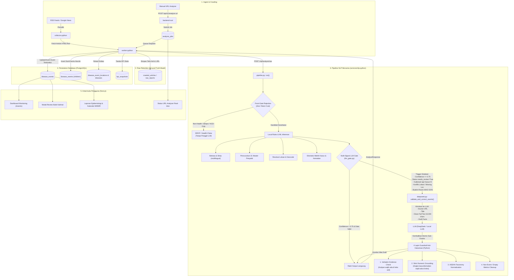

# Arsitektur & Alur Sistem Terkini serta Roadmap Peningkatan

**Tanggal Penyusunan:** 25 September 2026 WIB  
**Dokumen Referensi:** Audit 001–016, Matriks 009, Runtime Test Log 2026-09-25, dan Kode Sumber Aktif.

---

## 1. Executive Summary & Status Terkini

Berdasarkan penelusuran menyeluruh terhadap seluruh dokumen audit di `docs/audit`, catatan runtime di `docs/catatan`, dan penelusuran langsung di kode sumber (`frontend-next`, `backend-rust`, `collector-python`, `worker-python`, `nlp-python`, dan `PostgreSQL`), seluruh 9 sasaran transformasi awal (Matriks 009) telah berhasil diselesaikan:

1. **Master Penyakit ASEAN**: Migrasi dari WHO ICD-11 ke 31 Master Disease lokal ASEAN selesai di database dan runtime.
2. **Pembersihan Source**: Tersaring ke sumber Phase 1 dan Google News.
3. **Standarisasi Confidence `<= 0.75`**: Menggunakan operator inklusif yang konsisten.
4. **Otonomi Lokal**: Seluruh dependensi API eksternal pihak ketiga dilepas; NLP berjalan mandiri.
5. **Penetapan Health/Outbreak & Rule Dinamis**: 42 rules di PostgreSQL `extraction_rules` dengan modul UI `/nlp/extraction-rules`.
6. **Integrasi DeepSeek Rear-Gate**: Inspeksi langsung target URL (`source_url`), prompt surveilans epidemiologi, dan 4 lapis guardrail anti-halusinasi di Python.
7. **Pembersihan Data & Tombol Reset**: Tersedia kontrol `POST /api/v1/data/cleanup-events` dan modal UI di `/events` & `/console/settings`.
8. **Sakelar On/Off Sumber**: Kontrol per-source aktif/pause terhubung dari UI ke scheduler crawler.
9. **Gate Eskalasi Cerdas**: Multi-signal trigger yang mencegah bypass pada berita bermasalah.

---

## 2. Peta Alur Sistem End-to-End Saat Ini

Berikut adalah alur lengkap pemrosesan data di dalam sistem saat ini:

---

## 3. Rincian Eksekusi Setiap Lapisan

### A. Lapisan Ingest & Retensi Mentah
- Setiap artikel yang diambil oleh `collector-python` atau endpoint URL Analyzer di `backend-rust` **disimpan utuh tanpa modifikasi** ke dalam tabel `raw_reports` / `crawled_articles`.
- Data yang disimpan meliputi: `url`, `canonical_url`, `title`, `published_at`, `content` (hingga 35.000+ karakter), `content_hash`, dan `url_hash`.
- Data mentah ini **bersifat permanen dan tidak pernah ditimpa oleh LLM**, berfungsi sebagai *ground truth audit trail*.

### B. Lapisan Pipeline NLP Bersama (`pipeline.py`)
1. **Front-Gate (Pencegahan Pemborosan Token)**:
   - Artikel bertopik non-kesehatan (skripsi, judi online, politik, militer), penyakit pertanian/tanaman, dan penyakit tidak menular (NCD seperti kanker, diabetes) tanpa konteks wabah aktif **langsung di-drop di awal** (`return False`). Token LLM yang terpakai = 0.
2. **Local Rules & ML Inference**:
   - Deteksi bahasa menggunakan `multilingual.py`.
   - Ekstraksi nama penyakit menggunakan 31 Master Disease ASEAN (`disease_master.py`).
   - Pencocokan entitas geografis (Negara, Provinsi, Kota/Kabupaten) menggunakan `extractors.py` dan gazetteer ASEAN.
   - Ekstraksi angka metrik kasus dan kematian.
3. **Multi-Signal LLM Gate (`llm_gate.py`)**:
   - LLM tidak hanya dipicu oleh skor angka, melainkan oleh indikator anomali surveilans:
     - Skor `confidence <= 0.75` (inklusif).
     - Status `needs_review == True` (terjadi konflik geocode, relasi metrik ambigu, atau status epistemic meragukan).
     - Artikel diklasifikasikan sebagai wabah aktif (`is_explicit_outbreak`), tetapi angka kasus dan kematian masih 0 (seperti kasus Vietnam HFMD).
     - Terdeteksi konflik lokasi (seperti judul menyebut Mimika tetapi resolver mencocokkan ke Blitar).
     - Buletin resmi otoritas kesehatan (WHO DON / Sitrep Kemenkes).
4. **DeepSeek Rear-Gate & 4 Guardrail Anti-Halusinasi (`deepseek.py`)**:
   - Menerima `Source URL`, `Title`, `Clean Text`, dan draft fakta.
   - LLM membaca teks sumber dari URL tersebut dan menghasilkan sub-event atomik.
   - Hasil LLM diverifikasi oleh kode Python:
     - **Verbatim Evidence**: Kutipan kalimat wajib ada persis di teks sumber (`evidence.lower() in raw_text.lower()`). Kutipan karangan langsung dibuang.
     - **Numeric Grounding**: Angka kasus (misal 6.573) wajib benar-benar tertulis di teks sumber. Angka karangan dinolkan.
     - **Normalisasi Taksonomi**: Nama penyakit dipaksa mengikuti daftar resmi ASEAN.
     - **Koreksi Draft**: Nilai draft yang salah (seperti lokasi salah atau kasus 0) diperbarui dengan hasil koreksi terverifikasi.

### C. Lapisan Database & UI
- Worker menyimpan event hasil koreksi ke `disease_events`.
- Jika artikel menghasilkan beberapa kejadian di lokasi berbeda, sub-event dimasukkan sebagai anak yang menginduk ke `parent_event_id`.
- Kutipan kalimat bukti tersimpan di `epidemiological_evidence` sehingga operator dapat melihat alasan penetapan di modal Review UI.

---

## 4. Temuan Bottleneck dari Audit `/docs`

Berdasarkan audit 011, 014, dan `runtime-test-log`:

1. **Antrean Semaphore Single-Slot (`NLP_INFERENCE_CONCURRENCY = 1`)**:
   - Service NLP saat ini dibatasi hanya memproses 1 inferensi dalam satu waktu (`Semaphore(1)`).
   - Saat ada artikel berukuran besar (seperti WHO DON 17.000 karakter) yang memakan waktu pemrosesan lama, request lain menumpuk di antrean (wait time mencapai 163 detik), sehingga worker mencapai timeout 270 detik sebelum NLP selesai.
2. **Ketiadaan Entitas Pemekaran Wilayah di Gazetteer**:
   - Kabupaten baru di Indonesia (seperti Mimika, Timika, Nabire di Papua Tengah) belum terdaftar secara lengkap di kamus kota lokal `config.ASEAN_CITIES_DICT`.
3. **Pola Leksikon Kasus Belum Menjangkau Frasa Terjemahan Tertentu**:
   - Frasa seperti `"6.573 anak didiagnosis menderita..."` belum langsung ditangkap oleh regex lokal karena ketiadaan kata kunci `"kasus"` di dekat angka tersebut.

---

## 5. Roadmap: 5 Hal Strategis yang Perlu Dipasang Selanjutnya

Untuk menyempurnakan performa dan ketahanan sistem, berikut 5 rekomendasi pemasangan berikutnya:

| No. | Pemasangan Rekomendasi | Komponen Terkait | Manfaat Langsung |
|---:|---|---|---|
| 1 | **Pemisahan Antrean (Queue Decoupling) URL Analyzer vs RSS Bulk** | `services/worker-python/app/worker.py` & RabbitMQ | Pengujian manual URL Analyzer di UI tidak akan terhambat atau timeout akibat antrean ratusan crawling background RSS. |
| 2 | **Injeksi Entitas Pemekaran Papua & Kota Sekunder ASEAN ke Gazetteer** | `services/nlp-python/app/config.py` (`ASEAN_CITIES_DICT`) | Nama tempat seperti Timika, Mimika, Nabire, Merauke langsung terpetakan dengan geocode confidence 0.90+ tanpa perlu bantuan LLM. |
| 3 | **Pengayaan Regex Kasus untuk Frasa Demografis Terjemahan** | `services/nlp-python/app/extractors.py` | Pola `[angka] anak/balita/warga didiagnosis...` langsung ditangkap oleh regex lokal dalam < 1 ms (seperti kasus Vietnam 6.573 anak). |
| 4 | **Penyempurnaan Heartbeat / Progress Stage di URL Analyzer** | `services/collector-python/app/analysis_jobs.py` & Next.js UI | UI menampilkan indikator progres bertahap (*Fetching -> Processing NLP -> Verifying LLM -> Finished*) sehingga tidak tampak freeze. |
| 5 | **Optimasi Concurrency / Timeout Worker untuk Artikel Panjang** | `services/worker-python` & `docker-compose.yml` | Menaikkan timeout worker dari 270s ke 420s untuk buletin raksasa atau mengaktifkan multi-worker inference bila kapasitas CPU memungkinkan. |
